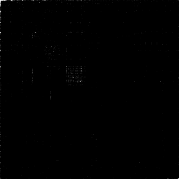

# Domas
Domas is a very simple console application I built to implement a Dynamic Binary Visualization algorithm. This algorithm was described by Christopher Domas (that's why it's called Domas), and its purpose is to detect file types by making a very simple file analysis.

> "_If we change the way we process binary information... we find unexpected ways of making sense of it_".

## How it works

> **DISCLAIMER**: I'm not Christopher Domas, so maybe all this explanation is just wrong. I'm just saying what **I** understood about the idea.

RE Dynamic Binary Visualization is an Reverse Engineering algorithm originally made to identify patterns in sequences of bytes by iterating over all the pairs of bytes and drawing a point on an image, threating the byte pair like (x, y) coordinates.

This can seem a bit nonsense but it actually generates really interesting patterns depending on the sequence of bytes. Here are some examples (you can see all these files in the `examples` folder):


| **Text** | **Image** | **Executable** | **Audio** |
| --- | --- | --- | --- |
|   |  |  |  |


## Getting Started

### Setup
Domas is written in Python, so you need the latest version of the Python interpreter installed on your machine.

To install all the dependencies of the application, you can just use `pip`.

Inside the repository's directory, run:
```console
$ pip install -r requirements.txt
```
Now you're ready to use Domas!

### Usage

To use Domas, just run the main script file at the `src` directory:
```console
$ python3 src/domas.py
```

See all the flags by the help message (use `-h` or `--help` flag).

#### The `--smooth` flag

If you are dealing with big files, it's helpful to use the `--smooth` flag to make final results more satisfying in terms of potential amount of information.
when `-s` (or `--smooth`) is turned on, it is applied a smooth brightness adjustment to each pixel based on pixel frequency.

Here are some files with the smooth flag enabled:

| **Text** | **Image** | **Executable** | **Audio** |
| --- | --- | --- | --- |
|   |  |  |  |

#### The `--scale` flag
This flag is very simple, it just scales the final image in times specified by the flag value. Default is 1x (256x256).

> NOTE: This doesn't change the actual quality of the image, it just scales the pixels to fit in it.

#### The `--format` flag

You can choose one of the following image formats to generate:

- PNG (default): `png`
- GIF: `gif`
- JPEG: `jpg` or `jpeg`
- BMP: `bmp` or `bitmap`

Use `-f`/`--format` to specify the file format of the final generated image, for example:

```console
$ python src/domas.py path/to/file -f png
$ python src/domas.py path/to/file -f jpeg
$ python src/domas.py path/to/file -f bitmap
...
```

#### The `--background` and `--foreground` flags
You can also customize the final generated image using the `--foreground` and `--background` flags, these are all the possible colors:

> Background is the color of the background itself of the image.
> Foreground is the color of the pixels plotted onto the image. 

- White: `white`
- Black: `black`
- Red: `red`
- Green: `green`
- Blue: `blue`
- Purple: `purple`
- Yellow: `yellow`

Here are some customized images:

| **Text** | **Image** | **Executable** | **Audio** |
| --- | --- | --- | --- |
|  <br> `white` and  `black` |  <br> `red` and `blue` |  <br> `blue` and `red` |  <br> `black` and `yellow` |


### Examples
There's a directory which has some files to play around with. You can generate the images for each file inside the folder by running:

```console
$ python src/domas.py ./examples
```

## Reference

| **4 2 1 Christopher Domas The future of RE Dynamic Binary Visualization** | **Christopher Domas aka the delta axiom The Future of RE Dynamic Binary Visualization** |
| --- | --- |
| [](https://www.youtube.com/watch?v=sUSFGXFo-Pw) | [](https://www.youtube.com/watch?v=4bM3Gut1hIk) | 

---

> By Marcio Dantas
